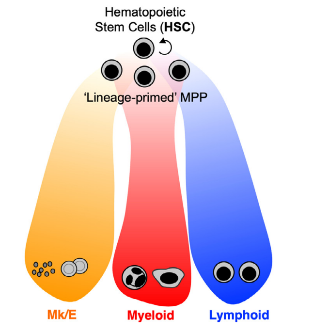

# Subspaces and embeddings

## "Siri, make me a UMAP"

Before making spin art plots of tens (or perhaps hundreds) of thousands of 
dollars' worth of data, one might consider what precisely is happening under
the hood. This is often prompted by the similar events to any trip under a
hood: "the machinery isn't doing what I want it to!" Fortunately, the tools
to diagnose typical UMAP disasters are cheaper than a car's OBD reader.


## How spin art works

Nonlinear dimension reduction schemes like tSNE and UMAP often operate in 
_reduced dimensions_. Given a number of dimensions, tSNE and UMAP attempt
to maximize the separation of minimally similar data points and vice versa,
while stuffing the results into a smaller number of dimensions (usually 2). 
(Trivia: the X and Y coordinates of a UMAP embedding change if you add a Z.)

In a single-cell RNAseq dataset, combinations of _features_ like transcripts
are usually _compressed_ via principal components analysis (PCA) to 30 or so
dimensions, then this is fed to tSNE or UMAP. This can clean up the plots. 

An old trick from microarray expression experiments is to mask features.
An older trick from statistics is to mask off _combinations_ of features.
Suppose Factor10 = 0.5xGENE1 + 2.6xGENE2 - 1.3xGENE345. Now suppose that
Factor 10 is almost entirely dependent upon technical artifacts. If we are
lucky, most of the tehcnical noise gets crammed into a few factors, and 
by removing those dimensions, we may find a more informative _subspace_ 
(a subset of the reduced dimensions that better captures our experiment). 


# Classifying leukemia by cell of origin 

Instead of a typical single-cell dataset, we are going to train a model on 
DNA methylation from leukemia patients and sorted healthy progenitor cells.
Our modern understanding of hematopoiesis (blood cell production) has 
settled around a scheme where hematopoietic stem cells (HSCs) provide life-
long blood supply, mostly by delegating work to shorter-lived multipotent 
progenitors (MPPs). These in turn generate primed progenitors, which seem
to diverge quickly into megakaryocyte-erythrocyte progenitors (MEPs) that 
make platelets and red blood cells; granulocyte-monocyte progenitors (GMPs) 
which make most types of innate immune cells; and lymphoid-primed 
multipotent progenitors, or LMPPs, which seem to be where most B and T cells
come from (it's all a bit mysterious, but these seem like the big splits). 

A diagram from Grant Challen's paper may clarify (or obscure) this concept:

[{fig-align="left"}](https://doi.org/10.1016/j.exphem.2021.09.007)

If these cells proliferate and refuse to differentiate, you get a leukemia. 
Some mutations occur repeatedly in leukemia, and patients are often assigned
to specific treatment based on the mutations seen in their disease. However,
[the cell from which their leukemia arose may better predict their responses](https://ashpublications.org/blood/article/141/13/1505/495015/Is-BCL-xL-the-Achilles-heel-of-AEL-and-AMKL). Historically that has been harder to model,
but 'epigenomic' assays like bisulfite or nanopore based DNA methylation
sequencing do a great job of capturing these differences. And they're cheap.


## Modeling normal and abnormal progenitors

Let's pull in raw data from 120 leukemia patients and 5 healthy donors. 
The healthy donors provided bone marrow which was then sorted to yield MEP, 
GMP, and LMPP fractions (separated on the basis of cell surface antigens). 
The data is stored as DNA methylation fractions across genomic coordinates,
and the column names indicate who is who and what is what (see below).  

```{r}

aml <- read.csv(url("https://trichelab.github.io/data/aml.csv"), row=1)
amlmeta <- data.frame(do.call(rbind, strsplit(colnames(aml), "_")))
names(amlmeta) <- c("ID", "status", "lineage")
rownames(amlmeta) <- colnames(aml)
with(amlmeta, table(lineage, status))

```

We can immediately observe two things:

  * The control set (MEP, GMP, LMPP) is balanced. 
  * The interesting set (leukemia patients) is severely imbalanced.

Let's see how this impacts our downstream adventures. 


## Fitting the data 

Let's skip a few steps and go directly to fitting an appropriate-dimensional
nonnegative matrix factorization (NMF) model of the data. (Why NMF? Because
you can't have negative amounts of DNA methylation, among other reasons.) 

```{r}

library(RcppML) 
aml <- data.matrix(aml) 
amlnmf <- nmf(aml, k=8, seed=42, maxit=100, verbose=FALSE)

```

The result of this is a _weights_ matrix W and a _hat_ (or scores) matrix H,
which when multiplied together, approximate the original data. The idea is
that we must have recovered most of the signal in the 824x135 data matrix,
and indeed the minimum reconstruction error (recovered vs. actual data)
occurs when we choose six (6) factors. So let's plot those. 

```{r}

# plot factor weights
hat <- t(amlnmf$h)
rownames(hat) <- colnames(aml)
colnames(hat) <- paste0("NMF", 1:ncol(hat))

library(scales)
amlmeta$grouping <- with(amlmeta, paste(status, lineage, sep="_"))
coloring <- c("#FFFFCC", "#CCCCFF", "#CC8888", 
              "#FFFF44", "#0000FF", "#CC0000")
names(coloring) <- with(amlmeta, names(table(grouping)))

library(reshape2)
melted <- melt(hat, value.name="weight")
names(melted) <- c("id", "factor", "weight")
melted$grouping <- amlmeta[melted$id, "grouping"]

# normalize to sample size
tbl <- table(grouping)
scaling <- min(tbl) / tbl
melted$normalized <- melted$weight * scaling[melted$grouping]

library(ggplot2)
library(forcats)
library(patchwork)

(p1 <- ggplot(melted) + 
        aes(x=weight, y=fct_rev(factor), fill=grouping) + 
        scale_x_continuous(labels=label_percent()) +
        scale_fill_manual(values=coloring) + 
        geom_bar(position="fill", stat="identity") + 
        labs(fill="Grouping", y=NULL, x="Raw weight") + 
        theme_classic())

(p2 <- ggplot(melted) + 
        aes(x=normalized, y=fct_rev(factor), fill=grouping) + 
        scale_x_continuous(labels=label_percent()) +
        scale_fill_manual(values=coloring) + 
        geom_bar(position="fill", stat="identity") + 
        labs(fill="Grouping", y=NULL, x="Normalized weight") + 
        theme_classic())

```

Now let's look at how this influences the resulting embedding (spin art). 

```{r}

library(uwot)

make_umap_df <- function(X, ..., meta) { 
  res <- data.frame(umap(X))
  names(res) <- paste0("UMAP", seq_len(ncol(res)))
  for (i in names(meta)) res[, i] <- meta[rownames(X), i]
  return(res)
}

library(glyph)

ump1 <- make_umap_df(hat, metric="cosine", meta=amlmeta)
glyph(ump1, x=UMAP1, y=UMAP2) |> 
  mark_point(color = grouping) |> 
  interact(tooltip = TRUE, hover = "enlarge") |>
  theme_tokens(preset = "minimal") |>
  titles(title = "Unmasked") ->
    g1

masked <- c(4, 7) 
unmasked <- setdiff(seq_len(ncol(hat)), masked)
ump2 <- make_umap_df(hat[, unmasked], metric="cosine", meta=amlmeta) 
glyph(ump2, x=UMAP1, y=UMAP2) |> 
  mark_point(color = grouping) |> 
  interact(tooltip = TRUE, hover = "enlarge") |>
  theme_tokens(preset = "minimal") |>
  titles(title = "Masked") ->
    g2

compose(g1, g2, 
        type="wrap", 
        linked_selections = TRUE) |> 
  render()

```

We can see from the normalized weights that factor 5 (NMF5) seems to have 
very little information coming from AML samples. This may be a good hint.


...
